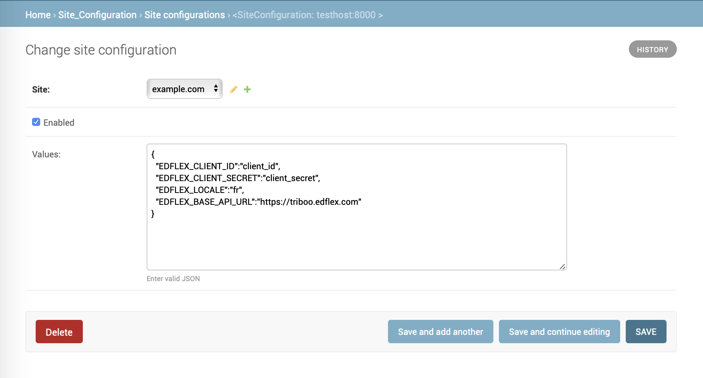

# Xblock Edflex
Use External Content component to add more resourse to you course.
Find according to your needs, MOOC, video, podcasts or articles.
A large choice of contents curated by Edflex technology to accompany you in creation or your trainings!
## Instalation
Install package
```
pip install -e git+https://github.com/Learningtribes/edflex-xblock.git#egg=edflex_xblock

```

## Set uping
In ```lms.env.json``` and ```cms.env.json```
add ```'edflex'``` to ```ADDL_INSTALL_APPS``` .
```
"ADDL_INSTALLED_APPS": [
    "edflex"
],
```

**According to settings configuration there are several options you can choose:**
* Configure Site configuration using django admin

    

* Set up your configurations in json files. Add the following to XBLOCK_SETTINGS inside `lms.env.json` and `cms.env.json`:
    
    ```
    "XBLOCK_SETTINGS": {
        "EdflexXBlock": {
            "EDFLEX_CLIENT_ID": "client_id",
            "EDFLEX_CLIENT_SECRET": "client_secret",
            "EDFLEX_LOCALE": ["en"],
            "EDFLEX_BASE_API_URL": "https://base/api/url"
        }
    },
    ```
   **Note:** Site configurations have higher priority than configurations in settings (means that the first attempts 
to read config will be from site configurations and then from settings)

Then apply migrations using
```
./manage.py lms migrate --settings=<name settings>
```
Fetch edflex data
```
./manage.py lms fetch_edflex_data --settings=<name settings>
```

## Running tasks

**There are also two options to run the periodic tasks:**
* First option is to use crontab

    ```
    0 1 * * 1 /path/to/virtualenv/bin/python /var/www/myapp/manage.py lms fetch_edflex_data --settings=<name settings>
    0 */1 * * * /path/to/virtualenv/bin/python /var/www/myapp/manage.py lms fetch_new_edflex_data --settings=<name settings>
    0 1 1 * * /path/to/virtualenv/bin/python /var/www/myapp/manage.py lms update_resources --settings=<name settings>
    ```
    
* Second option is to configure celery beat
    
    Ensure that celerybeat is running
    
    Set up variables in json files:
    ```
    "XBLOCK_SETTINGS": {
        "EdflexXBlock": {
            ...
            "EDFLEX_RESOURCES_FETCH_CRON": {
                "MINUTE": 0,
                "HOUR": 1,
                "DAY_OF_MONTH": "*",
                "MONTH_OF_YEAR": "*",
                "DAY_OF_WEEK": 1,
            },
             "EDFLEX_NEW_RESOURCES_FETCH_CRON": {
                "MINUTE": 0,
                "HOUR": "*/1",
                "DAY_OF_MONTH": "*",
                "MONTH_OF_YEAR": "*",
                "DAY_OF_WEEK": "*",
            },
            "EDFLEX_RESOURCES_UPDATE_CRON": {
                "MINUTE": 0,
                "HOUR": 1,
                "DAY_OF_MONTH": 1,
                "MONTH_OF_YEAR": "*",
                "DAY_OF_WEEK": "*",
            }
        }
    },
    ```
    
## Using
**Add edflex to the Advanced Module List for your course in Studio**    

Open Advanced Settings for your course in Studio ("Settings" drop down in the top nav -> "Advanced Settings"), and add ```"edflex"``` to the "Advanced Module List" value (i.e.: the value for "Advanced Module List" should be a JSON list, and that list should include ```"edflex"```).

   
    
## Running tests
To run unit tests in Docker you have to open the shell
```
./manage.py test_system --setting=test test edflex.tests
```
Instead of ```test_system``` choose the system you want to test (cms or lms)
 
